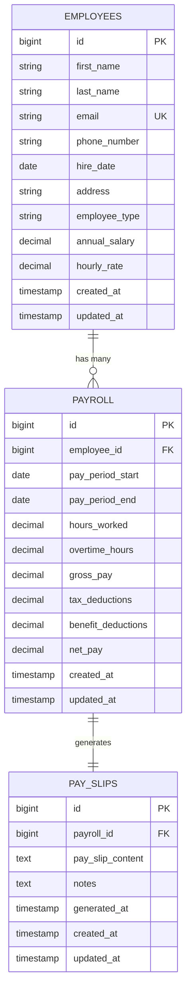

# Database Schema Documentation

## Overview

The Payroll Management System uses a PostgreSQL database (with MySQL support) designed to handle employee management, payroll processing, and pay slip generation efficiently.

## Database Design Principles

- **Normalization**: Tables are normalized to reduce redundancy
- **Inheritance**: Employee types use JPA inheritance (SINGLE_TABLE strategy)
- **Constraints**: Proper foreign key relationships and data validation
- **Indexing**: Optimized for common query patterns
- **Audit Trail**: Timestamps for data tracking

## Schema Overview



## Table Definitions

### employees

Stores all employee information using single table inheritance for different employee types.

| Column | Type | Constraints | Description |
|--------|------|-------------|-------------|
| id | BIGINT | PRIMARY KEY, AUTO_INCREMENT | Unique employee identifier |
| first_name | VARCHAR(100) | NOT NULL | Employee's first name |
| last_name | VARCHAR(100) | NOT NULL | Employee's last name |
| email | VARCHAR(255) | NOT NULL, UNIQUE | Employee's email address |
| phone_number | VARCHAR(20) | NOT NULL | Employee's phone number |
| hire_date | DATE | NOT NULL | Date employee was hired |
| address | TEXT | | Employee's address |
| employee_type | VARCHAR(20) | NOT NULL | 'SALARIED' or 'HOURLY' |
| annual_salary | DECIMAL(12,2) | | Annual salary for salaried employees |
| hourly_rate | DECIMAL(8,2) | | Hourly rate for hourly employees |
| created_at | TIMESTAMP | DEFAULT CURRENT_TIMESTAMP | Record creation time |
| updated_at | TIMESTAMP | DEFAULT CURRENT_TIMESTAMP ON UPDATE CURRENT_TIMESTAMP | Last update time |

**Indexes:**
- PRIMARY KEY: `id`
- UNIQUE KEY: `email`
- INDEX: `employee_type`
- INDEX: `hire_date`

**Constraints:**
- Email must be unique across all employees
- Employee type must be either 'SALARIED' or 'HOURLY'
- Annual salary required for salaried employees
- Hourly rate required for hourly employees

### payroll

Stores payroll records for each pay period.

| Column | Type | Constraints | Description |
|--------|------|-------------|-------------|
| id | BIGINT | PRIMARY KEY, AUTO_INCREMENT | Unique payroll record identifier |
| employee_id | BIGINT | NOT NULL, FOREIGN KEY | Reference to employees.id |
| pay_period_start | DATE | NOT NULL | Start date of pay period |
| pay_period_end | DATE | NOT NULL | End date of pay period |
| hours_worked | DECIMAL(6,2) | DEFAULT 0 | Hours worked in pay period |
| overtime_hours | DECIMAL(6,2) | DEFAULT 0 | Overtime hours worked |
| gross_pay | DECIMAL(12,2) | NOT NULL | Gross pay amount |
| tax_deductions | DECIMAL(12,2) | DEFAULT 0 | Tax deduction amount |
| benefit_deductions | DECIMAL(12,2) | DEFAULT 0 | Benefit deduction amount |
| net_pay | DECIMAL(12,2) | NOT NULL | Net pay amount (gross - deductions) |
| created_at | TIMESTAMP | DEFAULT CURRENT_TIMESTAMP | Record creation time |
| updated_at | TIMESTAMP | DEFAULT CURRENT_TIMESTAMP ON UPDATE CURRENT_TIMESTAMP | Last update time |

**Indexes:**
- PRIMARY KEY: `id`
- FOREIGN KEY: `employee_id` → `employees(id)`
- INDEX: `pay_period_start, pay_period_end`
- INDEX: `employee_id, pay_period_start`

**Constraints:**
- Pay period end must be after pay period start
- Gross pay must be greater than or equal to 0
- Net pay must be greater than or equal to 0
- Hours worked must be greater than or equal to 0

### pay_slips

Stores generated pay slips for payroll records.

| Column | Type | Constraints | Description |
|--------|------|-------------|-------------|
| id | BIGINT | PRIMARY KEY, AUTO_INCREMENT | Unique pay slip identifier |
| payroll_id | BIGINT | NOT NULL, FOREIGN KEY | Reference to payroll.id |
| pay_slip_content | TEXT | | Generated pay slip content/HTML |
| notes | TEXT | | Additional notes or comments |
| generated_at | TIMESTAMP | DEFAULT CURRENT_TIMESTAMP | When pay slip was generated |
| created_at | TIMESTAMP | DEFAULT CURRENT_TIMESTAMP | Record creation time |
| updated_at | TIMESTAMP | DEFAULT CURRENT_TIMESTAMP ON UPDATE CURRENT_TIMESTAMP | Last update time |

**Indexes:**
- PRIMARY KEY: `id`
- FOREIGN KEY: `payroll_id` → `payroll(id)`
- INDEX: `generated_at`
- INDEX: `payroll_id`

## Business Rules

### Employee Management
- Each employee must have a unique email address
- Employee type determines which fields are required:
  - SALARIED: annual_salary is required, hourly_rate is null
  - HOURLY: hourly_rate is required, annual_salary is null
- Hire date cannot be in the future

### Payroll Processing
- Pay periods cannot overlap for the same employee
- Gross pay calculation depends on employee type:
  - **Salaried**: `annual_salary / pay_periods_per_year`
  - **Hourly**: `(hours_worked * hourly_rate) + (overtime_hours * hourly_rate * 1.5)`
- Net pay = gross_pay - tax_deductions - benefit_deductions
- Net pay cannot be negative

### Pay Slip Generation
- One pay slip per payroll record
- Pay slips are immutable once generated
- Pay slip content is stored as formatted text/HTML

## Data Validation

### Application Level (JPA Annotations)
```java
@Entity
@Table(name = "employees")
public class Employee {
    @NotBlank(message = "First name is required")
    @Size(min = 2, max = 100, message = "First name must be between 2 and 100 characters")
    private String firstName;
    
    @Email(message = "Email should be valid")
    @Column(unique = true)
    private String email;
    
    @Past(message = "Hire date must be in the past")
    private LocalDate hireDate;
    
    @DecimalMin(value = "0.0", message = "Salary must be positive")
    private BigDecimal annualSalary;
}
```

### Database Level
```sql
-- Check constraints for data integrity
ALTER TABLE employees 
ADD CONSTRAINT chk_employee_type 
CHECK (employee_type IN ('SALARIED', 'HOURLY'));

ALTER TABLE employees 
ADD CONSTRAINT chk_salaried_salary 
CHECK (
    (employee_type = 'SALARIED' AND annual_salary IS NOT NULL AND hourly_rate IS NULL) OR
    (employee_type = 'HOURLY' AND hourly_rate IS NOT NULL AND annual_salary IS NULL)
);

ALTER TABLE payroll 
ADD CONSTRAINT chk_pay_period 
CHECK (pay_period_end > pay_period_start);

ALTER TABLE payroll 
ADD CONSTRAINT chk_positive_amounts 
CHECK (gross_pay >= 0 AND net_pay >= 0 AND tax_deductions >= 0 AND benefit_deductions >= 0);
```

## Common Queries

### Get all employees with their latest payroll
```sql
SELECT 
    e.id,
    e.first_name,
    e.last_name,
    e.email,
    e.employee_type,
    p.pay_period_start,
    p.pay_period_end,
    p.gross_pay,
    p.net_pay
FROM employees e
LEFT JOIN (
    SELECT employee_id, 
           pay_period_start, 
           pay_period_end, 
           gross_pay, 
           net_pay,
           ROW_NUMBER() OVER (PARTITION BY employee_id ORDER BY pay_period_end DESC) as rn
    FROM payroll
) p ON e.id = p.employee_id AND p.rn = 1
ORDER BY e.last_name, e.first_name;
```

### Get payroll summary for a specific period
```sql
SELECT 
    COUNT(*) as total_employees,
    SUM(gross_pay) as total_gross_pay,
    SUM(tax_deductions) as total_tax_deductions,
    SUM(benefit_deductions) as total_benefit_deductions,
    SUM(net_pay) as total_net_pay
FROM payroll 
WHERE pay_period_start >= '2025-09-01' 
  AND pay_period_end <= '2025-09-30';
```

### Get employee pay history
```sql
SELECT 
    p.pay_period_start,
    p.pay_period_end,
    p.hours_worked,
    p.overtime_hours,
    p.gross_pay,
    p.tax_deductions,
    p.benefit_deductions,
    p.net_pay,
    ps.generated_at as pay_slip_generated
FROM payroll p
LEFT JOIN pay_slips ps ON p.id = ps.payroll_id
WHERE p.employee_id = ?
ORDER BY p.pay_period_start DESC;
```

## Performance Optimization

### Indexes for Common Queries
```sql
-- Employee searches
CREATE INDEX idx_employee_name ON employees(last_name, first_name);
CREATE INDEX idx_employee_email ON employees(email);
CREATE INDEX idx_employee_hire_date ON employees(hire_date);

-- Payroll queries
CREATE INDEX idx_payroll_employee_period ON payroll(employee_id, pay_period_start, pay_period_end);
CREATE INDEX idx_payroll_period_range ON payroll(pay_period_start, pay_period_end);

-- Pay slip queries
CREATE INDEX idx_payslip_payroll ON pay_slips(payroll_id);
CREATE INDEX idx_payslip_generated_at ON pay_slips(generated_at);
```

### Query Optimization Tips
- Use LIMIT for large result sets
- Implement pagination in application layer
- Use appropriate indexes for WHERE clauses
- Consider partitioning for very large tables

## Backup and Recovery

### Daily Backup Strategy
```bash
# Full database backup
pg_dump -h localhost -U payroll_user -d payroll_db > backup_$(date +%Y%m%d).sql

# Compressed backup
pg_dump -h localhost -U payroll_user -d payroll_db | gzip > backup_$(date +%Y%m%d).sql.gz
```

### Point-in-Time Recovery
```bash
# Enable WAL archiving in postgresql.conf
archive_mode = on
archive_command = 'cp %p /path/to/archive/%f'

# Create base backup
pg_basebackup -D /path/to/backup -U replication_user -v -P -W
```

## Data Migration

### From MySQL to PostgreSQL
```sql
-- Data type mappings
-- MySQL BIGINT AUTO_INCREMENT → PostgreSQL BIGSERIAL
-- MySQL DECIMAL(12,2) → PostgreSQL NUMERIC(12,2)
-- MySQL TIMESTAMP → PostgreSQL TIMESTAMP WITH TIME ZONE

-- Migration script example
INSERT INTO employees (
    first_name, last_name, email, phone_number, hire_date, 
    address, employee_type, annual_salary, hourly_rate
)
SELECT 
    first_name, last_name, email, phone_number, hire_date,
    address, employee_type, annual_salary, hourly_rate
FROM mysql_employees;
```

## Security Considerations

### Database Security
- Use dedicated database users with minimal privileges
- Enable SSL connections for production
- Regularly update database software
- Monitor database access logs

### Data Privacy
- Encrypt sensitive data at rest
- Implement proper access controls
- Regular security audits
- Comply with data protection regulations

## Monitoring and Maintenance

### Key Metrics to Monitor
- Database connection pool usage
- Query performance (slow query log)
- Table sizes and growth rates
- Index usage statistics

### Maintenance Tasks
```sql
-- Update table statistics
ANALYZE employees;
ANALYZE payroll;
ANALYZE pay_slips;

-- Reindex tables periodically
REINDEX TABLE employees;

-- Check for unused indexes
SELECT schemaname, tablename, indexname, idx_tup_read, idx_tup_fetch
FROM pg_stat_user_indexes
WHERE idx_tup_read = 0;
```

---

This documentation should be updated whenever schema changes are made. All migrations should be tested in a development environment before applying to production.